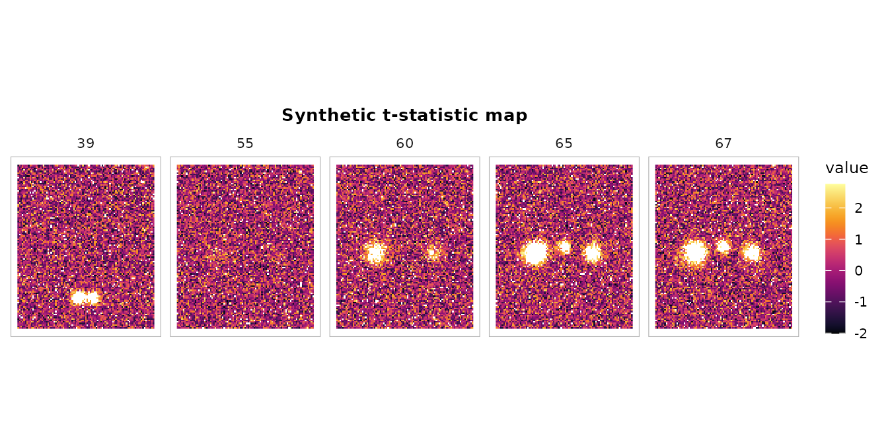
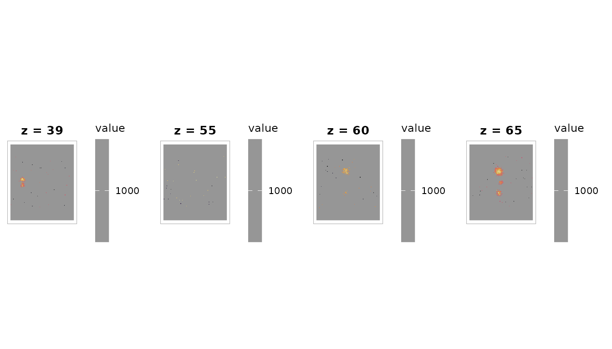

# Publication-quality activation tables

## Overview

[`cluster_table()`](https://bbuchsbaum.github.io/fmrireport/reference/cluster_table.md)
is fmrireport’s standalone function for building publication-quality
activation tables from any statistical brain volume. It follows COBIDAS
reporting guidelines: hierarchical cluster/sub-peak structure, world
coordinates, p-values, and optional anatomical labeling.

This vignette walks through creating realistic synthetic activations,
detecting clusters, formatting tables, and adding atlas labels.

## Creating synthetic activation maps

Real fMRI analyses produce `NeuroVol` objects from `fmrireg` or similar
packages. For demonstration, we’ll build a synthetic t-statistic volume
with Gaussian-shaped activation blobs placed at known locations.

``` r
library(fmrireport)
library(neuroim2)
#> Loading required package: Matrix
#> 
#> Attaching package: 'neuroim2'
#> The following object is masked from 'package:base':
#> 
#>     scale

# Define a brain-like volume in MNI-ish space
# 2mm isotropic, 91x109x91 grid, origin at (-90, -126, -72)
sp <- NeuroSpace(c(91, 109, 91),
                 spacing = c(2, 2, 2),
                 origin = c(-90, -126, -72))

# Start with Gaussian noise (simulating a t-stat map under the null)
set.seed(2024)
arr <- array(rnorm(prod(dim(sp))), dim(sp))
```

Now add Gaussian-shaped activation blobs. We’ll place them at grid
coordinates and use a smooth falloff to simulate realistic spatial
extent:

``` r
# Helper: add a 3D Gaussian blob centered at grid coordinate (cx, cy, cz)
add_gaussian_blob <- function(arr, cx, cy, cz, peak_value, sigma = 4) {
  dims <- dim(arr)
  # Work in a local window for efficiency
  radius <- ceiling(3 * sigma)
  x_range <- max(1, cx - radius):min(dims[1], cx + radius)
  y_range <- max(1, cy - radius):min(dims[2], cy + radius)
  z_range <- max(1, cz - radius):min(dims[3], cz + radius)

  for (xi in x_range) {
    for (yi in y_range) {
      for (zi in z_range) {
        d2 <- (xi - cx)^2 + (yi - cy)^2 + (zi - cz)^2
        arr[xi, yi, zi] <- arr[xi, yi, zi] +
          peak_value * exp(-d2 / (2 * sigma^2))
      }
    }
  }
  arr
}

# Place blobs at grid coordinates that map to known cortical MNI regions.
# With origin=(-90,-126,-72) and spacing=2mm:
#   grid (27,51,65) -> MNI (-38,-26,56) = Left SomMot
#   grid (65,51,65) -> MNI ( 38,-26,56) = Right SomMot
#   grid (46,55,67) -> MNI (  0,-18,62) = Medial motor
#   grid (41,21,39) -> MNI (-10,-86, 4) = Left V1
#   grid (51,21,39) -> MNI ( 10,-86, 4) = Right V1

# Blob 1: Left somatomotor cortex (large, strong activation)
arr <- add_gaussian_blob(arr, cx = 27, cy = 51, cz = 65, peak_value = 8, sigma = 5)

# Blob 2: Right somatomotor cortex (moderate)
arr <- add_gaussian_blob(arr, cx = 65, cy = 51, cz = 65, peak_value = 6, sigma = 4)

# Blob 3: Medial motor / SMA (moderate)
arr <- add_gaussian_blob(arr, cx = 46, cy = 55, cz = 67, peak_value = 5.5, sigma = 3)

# Blob 4: Left primary visual cortex (small, strong)
arr <- add_gaussian_blob(arr, cx = 41, cy = 21, cz = 39, peak_value = 7, sigma = 3)

# Blob 5: Right primary visual cortex (small, moderate)
arr <- add_gaussian_blob(arr, cx = 51, cy = 21, cz = 39, peak_value = 5, sigma = 3)

vol <- NeuroVol(arr, sp)
```

Let’s visualize the synthetic activation map:

``` r
# Show axial slices at the levels where we placed blobs
slices <- c(39, 55, 60, 65, 67)
plot_montage(vol, zlevels = slices, along = 3L,
             cmap = "inferno", ncol = 5L,
             title = "Synthetic t-statistic map")
```



## Basic cluster detection

Detect clusters at t \> 3.0 with default settings:

``` r
ct <- cluster_table(vol,
                    threshold = 3.0,
                    stat_type = "t",
                    df = 100,
                    min_cluster_size = 20)
print(ct)
#> cluster_table: 4 cluster(s)  |  threshold = 3.00 (t)  |  space = Unknown
#> 
#>   Cluster 1  (k = 1623, 12984 mm3)
#>     Peak:   x = -38.0  y = -26.0  z = 52.0  stat = 9.167  p = 6.635e-15
#>       sub-peak 2:  x = -38.0  y = -26.0  z = 54.0  stat = 9.063  p = 1.117e-14
#>       sub-peak 3:  x = -38.0  y = -30.0  z = 54.0  stat = 9.005  p = 1.495e-14
#> 
#>   Cluster 2  (k = 530, 4240 mm3)
#>     Peak:   x = 36.0  y = -28.0  z = 56.0  stat = 8.086  p = 1.485e-12
#>       sub-peak 2:  x = 42.0  y = -24.0  z = 60.0  stat = 7.330  p = 6.078e-11
#>       sub-peak 3:  x = 38.0  y = -28.0  z = 58.0  stat = 7.248  p = 9.031e-11
#> 
#>   Cluster 3  (k = 483, 3864 mm3)
#>     Peak:   x = -10.0  y = -88.0  z = 6.0  stat = 8.573  p = 1.307e-13
#>       sub-peak 2:  x = -10.0  y = -86.0  z = 4.0  stat = 8.439  p = 2.566e-13
#>       sub-peak 3:  x = -12.0  y = -88.0  z = 2.0  stat = 8.410  p = 2.965e-13
#> 
#>   Cluster 4  (k = 187, 1496 mm3)
#>     Peak:   x = -2.0  y = -18.0  z = 60.0  stat = 6.481  p = 3.481e-09
#>       sub-peak 2:  x = 2.0  y = -18.0  z = 62.0  stat = 6.439  p = 4.227e-09
#>       sub-peak 3:  x = -2.0  y = -16.0  z = 60.0  stat = 6.336  p = 6.804e-09
```

The output shows:

- **Cluster ID** and **size** (voxels and mm^3)
- **Peak coordinates** in world space (mm)
- **Peak statistic** and **p-value**
- **Sub-peaks** (local maxima) indented below each cluster

## Controlling sub-peak detection

The `local_maxima_dist` parameter sets the minimum distance (mm) between
reported sub-peaks. A larger value gives fewer, more distinct peaks:

``` r
# Tight distance: many sub-peaks
ct_tight <- cluster_table(vol, threshold = 3.0, stat_type = "t", df = 100,
                          local_maxima_dist = 8, max_peaks = 5)
cat("Sub-peaks with 8mm distance:\n")
#> Sub-peaks with 8mm distance:
nrow(ct_tight$peaks)
#> [1] 20

# Wide distance: fewer sub-peaks
ct_wide <- cluster_table(vol, threshold = 3.0, stat_type = "t", df = 100,
                         local_maxima_dist = 25, max_peaks = 5)
cat("Sub-peaks with 25mm distance:\n")
#> Sub-peaks with 25mm distance:
nrow(ct_wide$peaks)
#> [1] 20
```

## Sorting options

By default, clusters are sorted by size (descending). You can sort by
peak statistic instead:

``` r
ct_by_stat <- cluster_table(vol, threshold = 3.0, stat_type = "t", df = 100,
                            sort_by = "peak_stat")
# First cluster has the highest absolute peak stat
ct_by_stat$clusters[, c("cluster_id", "k", "peak_stat")]
#>   cluster_id    k peak_stat
#> 1          1 1623  9.166727
#> 2          3  483  8.573392
#> 3          2  530  8.085848
#> 4          4  187  6.480548
```

## P-value computation

[`cluster_table()`](https://bbuchsbaum.github.io/fmrireport/reference/cluster_table.md)
computes voxel-level p-values from the peak statistic and degrees of
freedom. Different statistic types are supported:

``` r
# t-statistic
ct_t <- cluster_table(vol, threshold = 3.0, stat_type = "t", df = 100)
head(ct_t$clusters[, c("peak_stat", "peak_p")])
#>   peak_stat       peak_p
#> 1  9.166727 6.635204e-15
#> 2  8.085848 1.485288e-12
#> 3  8.573392 1.307328e-13
#> 4  6.480548 3.481219e-09

# z-statistic (provide df to enable p-value computation)
ct_z <- cluster_table(vol, threshold = 3.0, stat_type = "z", df = 1)
head(ct_z$clusters[, c("peak_stat", "peak_p")])
#>   peak_stat       peak_p
#> 1  9.166727 4.876005e-20
#> 2  8.085848 6.173336e-16
#> 3  8.573392 1.004808e-17
#> 4  6.480548 9.138986e-11

# Without df, p-values are NA
ct_nodf <- cluster_table(vol, threshold = 3.0, stat_type = "t", df = NULL)
head(ct_nodf$clusters[, c("peak_stat", "peak_p")])
#>   peak_stat peak_p
#> 1  9.166727     NA
#> 2  8.085848     NA
#> 3  8.573392     NA
#> 4  6.480548     NA
```

## Flat data.frame output

[`as.data.frame()`](https://rdrr.io/r/base/as.data.frame.html) produces
a table where cluster-level rows have all columns populated and sub-peak
rows have `NA` for `k` and `Vol_mm3`:

``` r
df <- as.data.frame(ct)
df
#>    Cluster    k Vol_mm3   x   y  z     Stat            p Region Hemi
#> 1        1 1623   12984 -38 -26 52 9.166727 6.635204e-15     --   --
#> 2        1   NA      NA -38 -26 54 9.063289 1.117081e-14     --   --
#> 3        1   NA      NA -38 -30 54 9.005398 1.494920e-14     --   --
#> 4        2  530    4240  36 -28 56 8.085848 1.485288e-12     --   --
#> 5        2   NA      NA  42 -24 60 7.330006 6.077715e-11     --   --
#> 6        2   NA      NA  38 -28 58 7.248272 9.030698e-11     --   --
#> 7        3  483    3864 -10 -88  6 8.573392 1.307328e-13     --   --
#> 8        3   NA      NA -10 -86  4 8.438533 2.565961e-13     --   --
#> 9        3   NA      NA -12 -88  2 8.409609 2.964693e-13     --   --
#> 10       4  187    1496  -2 -18 60 6.480548 3.481219e-09     --   --
#> 11       4   NA      NA   2 -18 62 6.438897 4.227018e-09     --   --
#> 12       4   NA      NA  -2 -16 60 6.336318 6.804377e-09     --   --
```

## MNI coordinate column names

When you specify a known coordinate space, column headers adapt:

``` r
ct_mni <- cluster_table(vol, threshold = 3.0, stat_type = "t", df = 100,
                        coord_space = "MNI152")
df_mni <- as.data.frame(ct_mni)
names(df_mni)
#>  [1] "Cluster" "k"       "Vol_mm3" "MNI_x"   "MNI_y"   "MNI_z"   "Stat"   
#>  [8] "p"       "Region"  "Hemi"
```

## Formatted tables with tinytable

For inclusion in Quarto/R Markdown reports,
[`format_cluster_tt()`](https://bbuchsbaum.github.io/fmrireport/reference/format_cluster_tt.md)
produces a `tinytable` object with an informative caption:

``` r
tt <- format_cluster_tt(ct_mni, max_sub_peaks = 2, digits = 2)
tt
```

| Cluster | k    | Vol_mm3 | MNI_x | MNI_y | MNI_z | Stat | p   | Region | Hemi |
|---------|------|---------|-------|-------|-------|------|-----|--------|------|
| 1       | 1623 | 12984   | -38   | -26   | 52    | 9.17 | 0   | --     | --   |
| 1       | NA   | NA      | -38   | -26   | 54    | 9.06 | 0   | --     | --   |
| 1       | NA   | NA      | -38   | -30   | 54    | 9.01 | 0   | --     | --   |
| 2       | 530  | 4240    | 36    | -28   | 56    | 8.09 | 0   | --     | --   |
| 2       | NA   | NA      | 42    | -24   | 60    | 7.33 | 0   | --     | --   |
| 2       | NA   | NA      | 38    | -28   | 58    | 7.25 | 0   | --     | --   |
| 3       | 483  | 3864    | -10   | -88   | 6     | 8.57 | 0   | --     | --   |
| 3       | NA   | NA      | -10   | -86   | 4     | 8.44 | 0   | --     | --   |
| 3       | NA   | NA      | -12   | -88   | 2     | 8.41 | 0   | --     | --   |
| 4       | 187  | 1496    | -2    | -18   | 60    | 6.48 | 0   | --     | --   |
| 4       | NA   | NA      | 2     | -18   | 62    | 6.44 | 0   | --     | --   |
| 4       | NA   | NA      | -2    | -16   | 60    | 6.34 | 0   | --     | --   |

Threshold: t = 3 \| df = 100 \| Space: MNI152

## Atlas labeling

When you provide an atlas,
[`cluster_table()`](https://bbuchsbaum.github.io/fmrireport/reference/cluster_table.md)
automatically labels each peak with anatomical region names, hemisphere,
and (for parcellation atlases like Schaefer) network assignment.

``` r
library(neuroatlas)
#> 
#> Welcome to neuroatlas!
#> To use TemplateFlow features, you'll need to run:
#>   neuroatlas::install_templateflow()
#> This only needs to be done once and will create a persistent environment.
#> For more info, run: neuroatlas::check_templateflow()
#> 
#> Attaching package: 'neuroatlas'
#> The following object is masked from 'package:neuroim2':
#> 
#>     resample

# Load the Schaefer 200-parcel, 7-network atlas
atlas <- get_schaefer_atlas(parcels = "200", networks = "7")
#> downloading: https://raw.githubusercontent.com/ThomasYeoLab/CBIG/master/stable_projects/brain_parcellation/Schaefer2018_LocalGlobal/Parcellations/MNI//freeview_lut/Schaefer2018_200Parcels_7Networks_order.txt

ct_labeled <- cluster_table(vol, threshold = 3.0,
                            stat_type = "t", df = 100,
                            atlas = atlas,
                            coord_space = "MNI152")
print(ct_labeled)
#> cluster_table: 4 cluster(s)  |  threshold = 3.00 (t)  |  space = MNI152  |  atlas = Schaefer-200-7networks
#> 
#>   Cluster 1  (k = 1623, 12984 mm3)
#>     Peak:   [SomMot_10] (left)  MNI x = -38.0  MNI y = -26.0  MNI z = 52.0  stat = 9.167  p = 6.635e-15
#>       sub-peak 2:  [SomMot_10]  MNI x = -38.0  MNI y = -26.0  MNI z = 54.0  stat = 9.063  p = 1.117e-14
#>       sub-peak 3:  MNI x = -38.0  MNI y = -30.0  MNI z = 54.0  stat = 9.005  p = 1.495e-14
#> 
#>   Cluster 2  (k = 530, 4240 mm3)
#>     Peak:   [SomMot_12] (right)  MNI x = 36.0  MNI y = -28.0  MNI z = 56.0  stat = 8.086  p = 1.485e-12
#>       sub-peak 2:  [SomMot_12]  MNI x = 42.0  MNI y = -24.0  MNI z = 60.0  stat = 7.330  p = 6.078e-11
#>       sub-peak 3:  [SomMot_12]  MNI x = 38.0  MNI y = -28.0  MNI z = 58.0  stat = 7.248  p = 9.031e-11
#> 
#>   Cluster 3  (k = 483, 3864 mm3)
#>     Peak:   [Vis_10] (left)  MNI x = -10.0  MNI y = -88.0  MNI z = 6.0  stat = 8.573  p = 1.307e-13
#>       sub-peak 2:  [Vis_7]  MNI x = -10.0  MNI y = -86.0  MNI z = 4.0  stat = 8.439  p = 2.566e-13
#>       sub-peak 3:  [Vis_7]  MNI x = -12.0  MNI y = -88.0  MNI z = 2.0  stat = 8.410  p = 2.965e-13
#> 
#>   Cluster 4  (k = 187, 1496 mm3)
#>     Peak:   [SomMot_15] (left)  MNI x = -2.0  MNI y = -18.0  MNI z = 60.0  stat = 6.481  p = 3.481e-09
#>       sub-peak 2:  [SomMot_18]  MNI x = 2.0  MNI y = -18.0  MNI z = 62.0  stat = 6.439  p = 4.227e-09
#>       sub-peak 3:  [SomMot_15]  MNI x = -2.0  MNI y = -16.0  MNI z = 60.0  stat = 6.336  p = 6.804e-09
```

The labeled table now includes region name, hemisphere, and network for
each peak coordinate:

``` r
as.data.frame(ct_labeled)
#>    Cluster    k Vol_mm3 MNI_x MNI_y MNI_z     Stat            p    Region  Hemi
#> 1        1 1623   12984   -38   -26    52 9.166727 6.635204e-15 SomMot_10  left
#> 2        1   NA      NA   -38   -26    54 9.063289 1.117081e-14 SomMot_10  left
#> 3        1   NA      NA   -38   -30    54 9.005398 1.494920e-14        --    --
#> 4        2  530    4240    36   -28    56 8.085848 1.485288e-12 SomMot_12 right
#> 5        2   NA      NA    42   -24    60 7.330006 6.077715e-11 SomMot_12 right
#> 6        2   NA      NA    38   -28    58 7.248272 9.030698e-11 SomMot_12 right
#> 7        3  483    3864   -10   -88     6 8.573392 1.307328e-13    Vis_10  left
#> 8        3   NA      NA   -10   -86     4 8.438533 2.565961e-13     Vis_7  left
#> 9        3   NA      NA   -12   -88     2 8.409609 2.964693e-13     Vis_7  left
#> 10       4  187    1496    -2   -18    60 6.480548 3.481219e-09 SomMot_15  left
#> 11       4   NA      NA     2   -18    62 6.438897 4.227018e-09 SomMot_18 right
#> 12       4   NA      NA    -2   -16    60 6.336318 6.804377e-09 SomMot_15  left
```

## Combining with overlay plots

You can pair the cluster table with a brain overlay visualization:

``` r
# Create a thresholded overlay for visualization
arr_thresh <- as.array(vol)
arr_thresh[abs(arr_thresh) < 3.0] <- NA
vol_thresh <- NeuroVol(arr_thresh, sp)

# Create a background volume (uniform gray for this demo)
bg_arr <- array(1000, dim(sp))
bg <- NeuroVol(bg_arr, sp)

plot_overlay(bg, vol_thresh,
             zlevels = c(39, 55, 60, 65),
             along = 3L,
             ov_cmap = "inferno",
             ov_thresh = 0,
             ncol = 4L,
             title = "Thresholded activation (t > 3.0)")
```



## Connectivity options

By default, clusters use 26-connectivity (face, edge, and vertex
neighbors). You can switch to more conservative connectivity:

``` r
ct_6 <- cluster_table(vol, threshold = 3.0, stat_type = "t", df = 100,
                      connectivity = "6-connect")
ct_26 <- cluster_table(vol, threshold = 3.0, stat_type = "t", df = 100,
                       connectivity = "26-connect")
cat("6-connect clusters:", ct_6$n_clusters, "\n")
#> 6-connect clusters: 4
cat("26-connect clusters:", ct_26$n_clusters, "\n")
#> 26-connect clusters: 4
```

Stricter connectivity (6-connect) tends to break large clusters into
smaller pieces.

## Edge cases

The function handles edge cases gracefully:

``` r
# No suprathreshold voxels
ct_empty <- cluster_table(vol, threshold = 100)
ct_empty$n_clusters
#> [1] 0
print(ct_empty)
#> cluster_table: 0 clusters (threshold = 100 )

# Very liberal threshold (many small clusters filtered by min_cluster_size)
ct_liberal <- cluster_table(vol, threshold = 1.5, min_cluster_size = 50)
cat("Clusters with k >= 50:", ct_liberal$n_clusters, "\n")
#> Clusters with k >= 50: 20
```

## The cluster_table object

A `cluster_table` is an S3 list with these elements:

``` r
str(ct, max.level = 1)
#> List of 8
#>  $ clusters   :'data.frame': 4 obs. of  12 variables:
#>  $ peaks      :'data.frame': 12 obs. of  11 variables:
#>  $ threshold  : num 3
#>  $ stat_type  : chr "t"
#>  $ df         : num 100
#>  $ n_clusters : int 4
#>  $ coord_space: chr "Unknown"
#>  $ atlas_name : chr NA
#>  - attr(*, "class")= chr "cluster_table"
```

| Element       | Type       | Description                               |
|---------------|------------|-------------------------------------------|
| `clusters`    | data.frame | One row per cluster                       |
| `peaks`       | data.frame | Sub-peaks with rank within cluster        |
| `threshold`   | numeric    | Detection threshold used                  |
| `stat_type`   | character  | `"t"`, `"z"`, `"F"`, or `"other"`         |
| `df`          | numeric    | Degrees of freedom (NULL if not provided) |
| `n_clusters`  | integer    | Number of clusters                        |
| `coord_space` | character  | Coordinate space label                    |
| `atlas_name`  | character  | Atlas name or NA                          |

## Summary

[`cluster_table()`](https://bbuchsbaum.github.io/fmrireport/reference/cluster_table.md)
provides a complete pipeline from statistical volume to
publication-ready activation table: 1. Cluster detection via
[`neuroim2::conn_comp()`](https://bbuchsbaum.github.io/neuroim2/reference/conn_comp-methods.html)
2. Size filtering 3. World coordinate transformation 4. Sub-peak (local
maxima) identification 5. Optional atlas labeling via `neuroatlas` 6.
Parametric p-value computation

Output can be printed to the console, converted to a flat data.frame, or
formatted as a tinytable for direct inclusion in reports.
